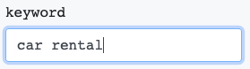
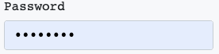
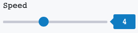
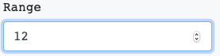
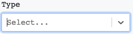
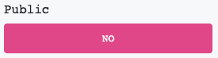

## SaaS front-end part

Next.js application

## How to setup?

- Clone repo
- `npm i -g yarn`
- `yarn`
- `cp .env.example .env`

You can find node and npm/yarn versions in `package.json`

## How to run application?

1. Development: 
    - `yarn dev`
2. Production:
    - `yarn build`
    - `yarn start`
    
### Available input types at the moment
- Text input: `string`* or `text` type**  
  
- Password input: `password`  
  
- Small range slider: `range`. Use `range` string field to provide range, like `'1-9'`  
  
- Large range input: `number` or `integer`. Use `range` string field to provide range, like `'0-99999'`  
  
- Select: `enum`. Use `values` array to provide params for it, like `['val1', 'val2']`  
  
- CheckBox-Button: `boolean`  
  

* - types are `case sensitive`! 
** - which type to use at bot script `PARAMS` section
