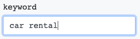
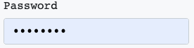
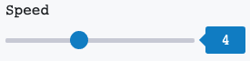
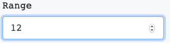
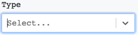
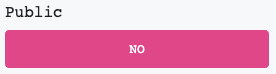
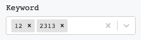

## SaaS front-end part

Next.js application

## Overview:

The app represents the web interface for managing, configuring and overviewing bots. 
It provides info about bots available for usage, works with existing bots and receiving bot's results in several ways (web interface, CSV).
The biggest part of the application interacts with the configured API and requires token authentication (Bearer Authentication).

The web interface is built with an option to update its state using web sockets from several resources like main API 
resource and specific bot as well.
The users can manage their accounts and subscriptions, run and manage bots, edit their profiles.
Depending on the authenticated user’s role, the application enables access to admin’s tools, which help to manage users,
 bots, subscriptions and open some features related only to the admin’s scope.

## How to setup?

- Clone repo
- `npm i -g yarn`
- `yarn`
- `cp .env.example .env`

You can find node and npm/yarn versions in `package.json`

## How to run application?

1. Development: 
    - `yarn dev`
2. Production:
    - `yarn build`
    - `yarn start`
    
### Available input types at the moment
- Text input: `string`* or `text` type**  
  
- Password input: `password`  
  
- Small range slider: `range`. Use `range` string field to provide range, like `'1-9'`  
  
- Large range input: `number` or `integer`. Use `range` string field to provide range, like `'0-99999'`  
  
- Select: `enum`. Use `values` array to provide params for it, like `['val1', 'val2']`  
  
- CheckBox-Button: `boolean`  
  
- MultiSelect: `multiselect`  
  

* - types are `case sensitive`! 
** - which type to use at bot script `PARAMS` section

The components, described above, are just a small example from the complete basic components list. All the core 
components are located in the `components/default` folder. 
The application is built using the components from the `components` directory.

The codebase is organized according to the Next.js framework file structure. The pages use React components, 
built by using Styled Components. Therefore, the styles are described inside the components.

The main application storage is based on Redux with the usage of saga and thunk middlewares. Basing on such stack, 
the store allows us to manage state depending on HTTP requests results (states as well), makes the code more clear and flexible.

The web sockets are integrated into the store, so it allows us to have a single interface for managing the app’s 
state without odd description or rules switching depending on data resources.

Env file configuration:

`API_URL` - Base API host URL

`SOCKET_URL` - Base Socket host URL

`STRIPE_PUBLIC_KEY` - Stripe client public key for the Stripe checkout functionality

`SENTRY_DSN` - Sentry DSN for tracking and monitoring the errors

TODOs:
- Interact with the offline bots using API
- Connect to the single Socket.io server instead of connecting to the bots separately.
- Merging the data from API and Sockets in the single data nodes
- Re-factor the interface structure according to the provided MockUps
- Features integration
